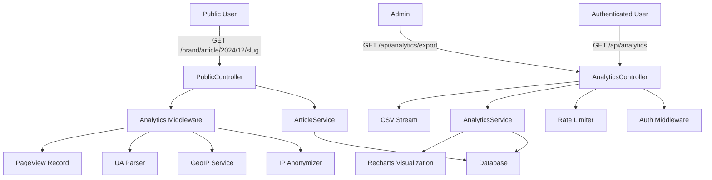

# Design Document

## Overview

Phase 3 (Public Analytics) introduces public article viewing with comprehensive disclaimer systems, privacy-compliant analytics tracking, visualization dashboards, and production hardening features. This design leverages existing infrastructure (Prisma models, Express routing, React components) and extends them with new services, controllers, middleware, and UI components.

The design follows the existing modular architecture: controllers handle HTTP requests with Zod validation, services contain business logic, utilities are single-purpose, and React pages compose reusable components.

## Steering Document Alignment

### Technical Standards (tech.md)

This implementation follows the existing technical patterns:
- **TypeScript**: Strict typing throughout with defined interfaces
- **Validation**: Zod schemas for all API inputs
- **Database**: Prisma ORM with existing PageView model
- **Frontend**: React 18+ with functional components, hooks, and context
- **Styling**: Tailwind CSS utility classes
- **i18n**: react-i18next for translations (EN/ES)
- **Error Handling**: Centralized error handler middleware
- **Testing**: Jest + React Testing Library + Playwright

### Project Structure (structure.md)

Following the established structure:
- `src/server/controllers/`: New analyticsController.ts, publicController.ts
- `src/server/services/`: New analyticsService.ts, geoipService.ts
- `src/server/utils/`: New ipAnonymizer.ts, userAgentParser.ts
- `src/server/middleware/`: New rateLimiter.ts, analytics.ts
- `src/client/pages/`: New Analytics.tsx, PublicArticle.tsx
- `src/client/components/`: New Analytics/, PublicArticle/, DisclaimerBanner/
- `src/client/locales/`: Extended translations for analytics

## Code Reuse Analysis

### Existing Components to Leverage

- **ArticleController**: Extend with public article retrieval method
- **ErrorHandler Middleware**: Use for consistent error responses
- **Auth Middleware**: Protect analytics routes
- **Database Config**: Reuse `db` instance for PageView queries
- **i18n Setup**: Extend with analytics translations
- **AuthContext**: Check user roles for analytics access
- **Tailwind Config**: Use existing color palette and responsive utilities

### Integration Points

- **PageView Model**: Already exists in Prisma schema (lines 101-113 in schema.prisma)
- **Article Model**: Has `pageViews` relation defined
- **User Model**: Language preference for i18n
- **API Routes**: Add new `/api/analytics/*` and `/api/track/*` endpoints
- **Public Routes**: Add `/:brandSlug/article/:year/:month/:slug` pattern
- **Frontend Routing**: Integrate Analytics page into dashboard navigation

## Architecture

The architecture follows a three-layer pattern:

1. **Presentation Layer** (React Components)
   - Public article view with disclaimers
   - Analytics dashboard with charts
   - CSV export functionality

2. **Application Layer** (Controllers & Middleware)
   - Request validation with Zod
   - Rate limiting
   - Analytics tracking middleware
   - Response formatting

3. **Business Logic Layer** (Services & Utilities)
   - Analytics aggregation
   - GeoIP lookup
   - IP anonymization
   - User agent parsing

### Modular Design Principles

- **Single File Responsibility**: Each service handles one domain (analytics, geoip, ip anonymization)
- **Component Isolation**: Disclaimer components, chart components, and analytics filters are separate
- **Service Layer Separation**: Analytics data access separated from aggregation logic
- **Utility Modularity**: IP hashing, UA parsing, GeoIP are independent utilities



## Components and Interfaces

### Backend Components

#### 1. PublicController
- **Purpose:** Handle public article viewing requests
- **File:** `src/server/controllers/publicController.ts`
- **Interfaces:**
  - `viewArticle(req, res)`: Get published article by brand slug and article slug
- **Dependencies:**
  - Database (Prisma)
  - Analytics middleware
- **Reuses:** Error handler middleware

#### 2. AnalyticsController
- **Purpose:** Handle analytics data requests and exports
- **File:** `src/server/controllers/analyticsController.ts`
- **Interfaces:**
  - `getOverview(req, res)`: Global analytics stats
  - `getBrandAnalytics(req, res)`: Brand-specific stats
  - `getArticleAnalytics(req, res)`: Article-specific stats
  - `exportAnalytics(req, res)`: Export CSV
- **Dependencies:**
  - AnalyticsService
  - Auth middleware (super admin only)
  - Rate limiter
- **Reuses:** Error handler, auth middleware pattern

#### 3. AnalyticsService
- **Purpose:** Business logic for analytics aggregation
- **File:** `src/server/services/analyticsService.ts`
- **Interfaces:**
  - `getGlobalStats()`: Total views, articles, brands
  - `getViewsOverTime(filters)`: Time series data
  - `getDeviceBreakdown(filters)`: Device type distribution
  - `getGeographicDistribution(filters)`: Country-based stats
  - `getTopArticles(filters)`: Most viewed articles
  - `streamAnalyticsCSV(filters)`: Stream CSV data
- **Dependencies:** Database (Prisma)
- **Reuses:** Existing Prisma patterns from BrandService

#### 4. GeoIP Service
- **Purpose:** IP address to geographic location lookup
- **File:** `src/server/services/geoipService.ts`
- **Interfaces:**
  - `lookup(ip: string): Promise<{ country, city } | null>`
- **Dependencies:** geoip-lite or similar library
- **Reuses:** None (new utility)

#### 5. IP Anonymizer Utility
- **Purpose:** Hash IP addresses for GDPR compliance
- **File:** `src/server/utils/ipAnonymizer.ts`
- **Interfaces:**
  - `anonymizeIP(ip: string): string`: SHA-256 hash
- **Dependencies:** Node crypto module
- **Reuses:** None (new utility)

#### 6. User Agent Parser Utility
- **Purpose:** Extract browser, OS, device from user agent string
- **File:** `src/server/utils/userAgentParser.ts`
- **Interfaces:**
  - `parseUserAgent(ua: string): { browser, os, device }`
- **Dependencies:** ua-parser-js or similar
- **Reuses:** None (new utility)

#### 7. Rate Limiter Middleware
- **Purpose:** Prevent API abuse
- **File:** `src/server/middleware/rateLimiter.ts`
- **Interfaces:**
  - `apiRateLimiter`: 100 req/15min per IP
  - `aiGenerationRateLimiter`: 5 req/hour per user
- **Dependencies:** express-rate-limit
- **Reuses:** Auth middleware pattern

#### 8. Analytics Tracking Middleware
- **Purpose:** Track page views on public articles
- **File:** `src/server/middleware/analytics.ts`
- **Interfaces:**
  - `trackPageView(req, res, next)`: Record view after response
- **Dependencies:**
  - IP Anonymizer
  - GeoIP Service
  - UA Parser
  - Database
- **Reuses:** Middleware pattern from auth.ts

### Frontend Components

#### 9. PublicArticle Page
- **Purpose:** Display article with disclaimers to public
- **File:** `src/client/pages/PublicArticle.tsx`
- **Interfaces:**
  - Route params: `/:brandSlug/article/:year/:month/:slug`
- **Dependencies:**
  - DisclaimerBanner component
  - DisclaimerFooter component
  - Watermark component
  - API service
- **Reuses:** Tailwind styling patterns from Dashboard

#### 10. Analytics Page
- **Purpose:** Dashboard for viewing analytics data
- **File:** `src/client/pages/Analytics.tsx`
- **Interfaces:**
  - Filter controls (date range, brand, article)
  - Chart visualizations
  - Export button
- **Dependencies:**
  - AnalyticsCharts component
  - AnalyticsFilters component
  - TopArticlesTable component
  - API service
  - AuthContext (role check)
- **Reuses:** Dashboard layout patterns, useAuth hook

#### 11. DisclaimerBanner Component
- **Purpose:** Sticky top banner with warning
- **File:** `src/client/components/PublicArticle/DisclaimerBanner.tsx`
- **Interfaces:**
  - Props: `language: 'en' | 'es'`
- **Dependencies:** react-i18next
- **Reuses:** Tailwind utility classes

#### 12. Watermark Component
- **Purpose:** Semi-transparent "FICTIONAL" overlay
- **File:** `src/client/components/PublicArticle/Watermark.tsx`
- **Interfaces:**
  - Props: `text: string`
- **Dependencies:** None
- **Reuses:** Tailwind positioning classes

#### 13. AnalyticsCharts Component
- **Purpose:** Render Recharts visualizations
- **File:** `src/client/components/Analytics/AnalyticsCharts.tsx`
- **Interfaces:**
  - Props: `data: AnalyticsData, loading: boolean`
  - Renders: LineChart, PieChart, BarChart
- **Dependencies:** recharts library
- **Reuses:** Tailwind grid layout

#### 14. AnalyticsFilters Component
- **Purpose:** Date range, brand, article filters
- **File:** `src/client/components/Analytics/AnalyticsFilters.tsx`
- **Interfaces:**
  - Props: `onFilterChange: (filters) => void`
  - Emits: Filter state object
- **Dependencies:** React state hooks
- **Reuses:** Form input patterns from existing pages

#### 15. Disclaimer Configuration Files
- **Purpose:** Editable disclaimer content
- **File:** `src/config/disclaimers.json` or `src/config/disclaimers/`
- **Interfaces:**
  - JSON structure with EN/ES translations
  - Sections: banner, footer, meta description
- **Dependencies:** None
- **Reuses:** None (new config)

## Data Models

### PageView (Already exists in Prisma)
```typescript
interface PageView {
  id: string              // UUID
  articleId: string       // Foreign key to Article
  ipAddress: string       // SHA-256 hashed
  country: string | null  // From GeoIP
  city: string | null     // From GeoIP
  browser: string | null  // From UA parsing
  os: string | null       // From UA parsing
  device: string | null   // desktop | mobile | tablet
  referrer: string | null // HTTP Referer header
  timestamp: Date         // Auto-generated
}
```

### AnalyticsStats (Service Interface)
```typescript
interface AnalyticsStats {
  totalViews: number
  totalArticles: number
  totalBrands: number
  viewsOverTime: Array<{ date: string; views: number }>
  deviceBreakdown: Array<{ device: string; count: number; percentage: number }>
  geographicDistribution: Array<{ country: string; count: number }>
  topArticles: Array<{
    id: string
    title: string
    brand: string
    views: number
    lastViewed: Date
  }>
}
```

### AnalyticsFilters (Request Interface)
```typescript
interface AnalyticsFilters {
  startDate?: Date
  endDate?: Date
  brandId?: string
  articleId?: string
  limit?: number    // For top articles
  offset?: number   // For pagination
}
```

### DisclaimerConfig (Configuration)
```typescript
interface DisclaimerConfig {
  banner: {
    en: { icon: string; text: string }
    es: { icon: string; text: string }
  }
  footer: {
    en: { title: string; content: string }
    es: { title: string; content: string }
  }
  watermark: {
    text: string      // Same for all languages
    opacity: number   // 0.03
    rotation: number  // -45
  }
  metaTags: {
    robots: string    // "noindex, nofollow"
    ogPrefix: string  // "[FICTIONAL] "
  }
}
```

### GeoIPResult (Utility Interface)
```typescript
interface GeoIPResult {
  country: string | null
  city: string | null
}
```

### UserAgentInfo (Utility Interface)
```typescript
interface UserAgentInfo {
  browser: string | null     // "Chrome 120.0"
  os: string | null          // "Windows 10"
  device: 'desktop' | 'mobile' | 'tablet' | null
}
```

## API Endpoints

### Public Routes (No auth required)
- `GET /:brandSlug/article/:year/:month/:slug` - View published article
- `POST /api/track/:articleId` - Track page view (called by frontend)

### Protected Routes (Auth required)
- `GET /api/analytics/overview` - Global stats (super admin only)
- `GET /api/analytics/brand/:id` - Brand stats
- `GET /api/analytics/article/:id` - Article stats
- `GET /api/analytics/export` - Export CSV (super admin only)

### Rate Limiting
- Public article viewing: No limit (read-only)
- Analytics endpoints: 100 req/15min per IP
- AI generation (existing): 5 req/hour per user

## Error Handling

### Error Scenarios

1. **Article Not Found (404)**
   - **Handling:** Return 404 with message "Article not found"
   - **User Impact:** Public sees "Article not found" page

2. **Article is Draft (404)**
   - **Handling:** Return 404 to prevent leaking draft content
   - **User Impact:** Public sees "Article not found" (same as above)

3. **Unauthorized Analytics Access (401)**
   - **Handling:** Return 401 if user not authenticated
   - **User Impact:** Redirect to login

4. **Forbidden Analytics Access (403)**
   - **Handling:** Return 403 if user role insufficient
   - **User Impact:** Show "Permission denied" message

5. **GeoIP Service Failure**
   - **Handling:** Log warning, set country/city to null, continue tracking
   - **User Impact:** None (graceful degradation)

6. **Rate Limit Exceeded (429)**
   - **Handling:** Return 429 with retry-after header
   - **User Impact:** Show "Too many requests, please try again later"

7. **CSV Export Memory Error**
   - **Handling:** Stream data in chunks, catch errors
   - **User Impact:** Show "Export failed, try with smaller date range"

8. **Invalid Filter Parameters (400)**
   - **Handling:** Zod validation returns 400 with field errors
   - **User Impact:** Show validation messages on filter form

## Security Measures

### Input Validation
- All API endpoints use Zod schemas
- Validate date ranges, UUIDs, enums
- Sanitize user input to prevent XSS

### Rate Limiting
```typescript
// API rate limiter (100 req/15min per IP)
const apiLimiter = rateLimit({
  windowMs: 15 * 60 * 1000,
  max: 100,
  message: 'Too many requests, please try again later',
});

// AI generation limiter (5 req/hour per user)
const aiLimiter = rateLimit({
  windowMs: 60 * 60 * 1000,
  max: 5,
  keyGenerator: (req) => req.user.userId,
  message: 'AI generation limit exceeded',
});
```

### Security Headers (helmet.js)
```typescript
app.use(helmet({
  contentSecurityPolicy: {
    directives: {
      defaultSrc: ["'self'"],
      scriptSrc: ["'self'", "'unsafe-inline'"],
      styleSrc: ["'self'", "'unsafe-inline'"],
      imgSrc: ["'self'", "data:", "https:"],
    },
  },
  hsts: {
    maxAge: 31536000,
    includeSubDomains: true,
  },
}));
```

### IP Anonymization
```typescript
// Before storing IP in database
const anonymizedIP = crypto
  .createHash('sha256')
  .update(ipAddress)
  .digest('hex');
```

### Meta Tags for Public Articles
```html
<meta name="robots" content="noindex, nofollow">
<meta property="og:title" content="[FICTIONAL] Article Title">
<meta property="og:description" content="This is fictional content...">
```

## Internationalization (i18n)

### Translation Keys to Add

**EN (src/client/locales/en/common.json):**
```json
{
  "analytics": {
    "title": "Analytics",
    "overview": "Overview",
    "totalViews": "Total Views",
    "totalArticles": "Total Articles",
    "viewsOverTime": "Views Over Time",
    "deviceBreakdown": "Device Breakdown",
    "geographicDistribution": "Geographic Distribution",
    "topArticles": "Top Articles",
    "export": "Export CSV",
    "filters": {
      "dateRange": "Date Range",
      "brand": "Brand",
      "article": "Article",
      "apply": "Apply Filters"
    }
  },
  "disclaimer": {
    "banner": "⚠️ FICTIONAL CONTENT - This article is entirely fictional",
    "footer": {
      "title": "Disclaimer",
      "content": "This article is entirely fictional and created for entertainment purposes only. All names, characters, events, and locations are products of imagination. Any resemblance to actual persons, living or dead, or actual events is purely coincidental."
    }
  },
  "public": {
    "notFound": "Article not found",
    "readTime": "min read",
    "relatedArticles": "Related Articles"
  }
}
```

**ES (src/client/locales/es/common.json):**
```json
{
  "analytics": {
    "title": "Analíticas",
    "overview": "Resumen",
    "totalViews": "Visitas Totales",
    "totalArticles": "Artículos Totales",
    "viewsOverTime": "Visitas a lo Largo del Tiempo",
    "deviceBreakdown": "Distribución por Dispositivo",
    "geographicDistribution": "Distribución Geográfica",
    "topArticles": "Artículos Principales",
    "export": "Exportar CSV",
    "filters": {
      "dateRange": "Rango de Fechas",
      "brand": "Marca",
      "article": "Artículo",
      "apply": "Aplicar Filtros"
    }
  },
  "disclaimer": {
    "banner": "⚠️ CONTENIDO FICTICIO - Este artículo es completamente ficticio",
    "footer": {
      "title": "Descargo de Responsabilidad",
      "content": "Este artículo es completamente ficticio y creado solo con fines de entretenimiento. Todos los nombres, personajes, eventos y ubicaciones son productos de la imaginación. Cualquier parecido con personas reales, vivas o muertas, o eventos reales es pura coincidencia."
    }
  },
  "public": {
    "notFound": "Artículo no encontrado",
    "readTime": "min de lectura",
    "relatedArticles": "Artículos Relacionados"
  }
}
```

## Production Hardening

### 1. Database Backups
```bash
# Daily backup script (scripts/backup-db.sh)
#!/bin/bash
BACKUP_DIR="./backups"
TIMESTAMP=$(date +%Y%m%d_%H%M%S)
cp ./data/fictional_news.db "$BACKUP_DIR/fictional_news_$TIMESTAMP.db"
# Keep only last 7 days
find $BACKUP_DIR -name "fictional_news_*.db" -mtime +7 -delete
```

### 2. Logging (Winston)
```typescript
import winston from 'winston';

const logger = winston.createLogger({
  level: 'info',
  format: winston.format.json(),
  transports: [
    new winston.transports.File({ filename: 'error.log', level: 'error' }),
    new winston.transports.File({ filename: 'combined.log' }),
  ],
});

if (process.env.NODE_ENV !== 'production') {
  logger.add(new winston.transports.Console({
    format: winston.format.simple(),
  }));
}
```

### 3. Health Check Endpoint
```typescript
// GET /health
app.get('/health', async (req, res) => {
  try {
    // Check database connection
    await db.$queryRaw`SELECT 1`;

    const appVersion = await db.appVersion.findFirst({
      orderBy: { appliedAt: 'desc' },
    });

    res.json({
      status: 'healthy',
      version: process.env.npm_package_version,
      dbVersion: appVersion?.version,
      timestamp: new Date().toISOString(),
    });
  } catch (error) {
    res.status(503).json({
      status: 'unhealthy',
      error: 'Database connection failed',
    });
  }
});
```

### 4. Graceful Shutdown
```typescript
process.on('SIGTERM', async () => {
  console.log('SIGTERM received, shutting down gracefully');
  server.close(() => {
    console.log('HTTP server closed');
    db.$disconnect();
    process.exit(0);
  });
});
```

### 5. Docker Health Check
```dockerfile
HEALTHCHECK --interval=30s --timeout=10s --retries=3 \
  CMD curl -f http://localhost:3000/health || exit 1
```

## Performance Optimizations

### 1. Analytics Query Optimization
- Use Prisma's `groupBy` for aggregations
- Add database indexes on `timestamp`, `articleId`, `country`
- Limit date ranges to prevent full table scans
- Use pagination for large result sets

### 2. CSV Export Streaming
```typescript
async streamAnalyticsCSV(res: Response, filters: AnalyticsFilters) {
  res.setHeader('Content-Type', 'text/csv');
  res.setHeader('Content-Disposition', 'attachment; filename=analytics.csv');

  const stream = res;
  stream.write('Timestamp,Article,Brand,Country,City,Browser,OS,Device\n');

  // Stream in batches of 1000
  let skip = 0;
  const take = 1000;

  while (true) {
    const batch = await db.pageView.findMany({
      where: { /* filters */ },
      take,
      skip,
      include: { article: { include: { brand: true } } },
    });

    if (batch.length === 0) break;

    batch.forEach(view => {
      stream.write(/* CSV row */);
    });

    skip += take;
  }

  stream.end();
}
```

### 3. Frontend Optimizations
- Lazy load Recharts components
- Debounce filter changes (500ms)
- Use React.memo for chart components
- Cache analytics data with react-query or SWR
- Compress large CSV downloads

### 4. Database Indexes (Migration)
```sql
-- migrations/1.2.0/001_add_analytics_indexes.sql
CREATE INDEX idx_pageview_timestamp ON PageView(timestamp);
CREATE INDEX idx_pageview_articleid ON PageView(articleId);
CREATE INDEX idx_pageview_country ON PageView(country);
CREATE INDEX idx_article_status ON Article(status);
CREATE INDEX idx_article_publishedat ON Article(publishedAt);
```

## Testing Strategy

### Unit Testing

**Services:**
- `analyticsService.test.ts`: Test aggregation logic with mock data
- `geoipService.test.ts`: Test IP lookup with known IPs
- `ipAnonymizer.test.ts`: Test SHA-256 hashing consistency
- `userAgentParser.test.ts`: Test parsing various UA strings

**Utilities:**
- Test edge cases (null, undefined, malformed input)
- Test GDPR compliance (IP not stored raw)

**Components:**
- `DisclaimerBanner.test.tsx`: Test rendering with EN/ES
- `AnalyticsCharts.test.tsx`: Test chart rendering with mock data
- `AnalyticsFilters.test.tsx`: Test filter state changes

### Integration Testing

**API Endpoints:**
- `GET /api/analytics/overview`: Test with auth, without auth, with filters
- `GET /api/analytics/export`: Test CSV generation, streaming
- `GET /:brandSlug/article/:year/:month/:slug`: Test published vs draft
- `POST /api/track/:articleId`: Test page view recording

**Middleware:**
- `rateLimiter.test.ts`: Test rate limit enforcement
- `analytics.test.ts`: Test tracking middleware flow

### End-to-End Testing

**Playwright Scenarios:**

1. **Public Article Viewing**
   - Navigate to public article URL
   - Verify disclaimer banner visible
   - Verify watermark overlay present
   - Verify footer disclaimer
   - Verify meta tags in HTML head
   - Verify page view recorded in database

2. **Analytics Dashboard**
   - Login as super admin
   - Navigate to analytics page
   - Verify charts render
   - Apply filters (date range, brand)
   - Verify data updates
   - Export CSV and verify download

3. **Rate Limiting**
   - Make 101 requests to analytics endpoint
   - Verify 101st returns 429
   - Verify retry-after header present

4. **i18n**
   - Switch language to Spanish
   - Verify analytics labels in Spanish
   - View public article in Spanish
   - Verify disclaimer in Spanish

### Performance Testing

**Load Testing (Artillery/k6):**
- 100 concurrent users viewing public articles
- 50 concurrent users accessing analytics dashboard
- Test response times < 2 seconds for dashboard
- Test page view tracking < 100ms

**Lighthouse:**
- Public article page score > 90
- Check accessibility, best practices, SEO

### Security Testing

**OWASP ZAP Scan:**
- XSS vulnerability testing
- SQL injection testing (Prisma should prevent)
- Security headers verification
- Rate limiting bypass attempts

### Test Coverage Goals
- Unit tests: 80%+ coverage
- Integration tests: 70%+ coverage
- E2E tests: All critical user flows
- Total coverage: 75%+

## Migration Plan

### Database Migration (1.2.0)

**File:** `migrations/1.2.0/001_add_analytics_indexes.sql`
```sql
-- Description: Add indexes for analytics query performance
-- Version: 1.2.0
-- Date: 2024-12-XX

CREATE INDEX IF NOT EXISTS idx_pageview_timestamp ON PageView(timestamp);
CREATE INDEX IF NOT EXISTS idx_pageview_articleid ON PageView(articleId);
CREATE INDEX IF NOT EXISTS idx_pageview_country ON PageView(country);
CREATE INDEX IF NOT EXISTS idx_article_status ON Article(status);
CREATE INDEX IF NOT EXISTS idx_article_publishedat ON Article(publishedAt);
```

**File:** `migrations/1.2.0/002_add_disclaimer_config.sql`
```sql
-- Description: Add system configuration table for disclaimers
-- Version: 1.2.0
-- Date: 2024-12-XX

CREATE TABLE IF NOT EXISTS SystemConfig (
  id TEXT PRIMARY KEY DEFAULT (uuid()),
  key TEXT UNIQUE NOT NULL,
  value TEXT NOT NULL,
  updatedAt DATETIME DEFAULT CURRENT_TIMESTAMP
);

-- Insert default disclaimer configurations
INSERT INTO SystemConfig (key, value) VALUES
  ('disclaimer_banner_en', '⚠️ FICTIONAL CONTENT - This article is entirely fictional'),
  ('disclaimer_banner_es', '⚠️ CONTENIDO FICTICIO - Este artículo es completamente ficticio'),
  ('disclaimer_footer_en', 'This article is entirely fictional and created for entertainment purposes only...'),
  ('disclaimer_footer_es', 'Este artículo es completamente ficticio y creado solo con fines de entretenimiento...');
```

### Version Bump
```bash
npm run version:minor  # 1.1.0 -> 1.2.0
```

## Deployment Checklist

- [ ] Run all tests (unit, integration, e2e)
- [ ] Create migration files in `migrations/1.2.0/`
- [ ] Update version in package.json (npm run version:minor)
- [ ] Build Docker image
- [ ] Test Docker container locally
- [ ] Verify health check endpoint
- [ ] Configure environment variables (.env)
- [ ] Set up daily backup cron job
- [ ] Configure Sentry (optional)
- [ ] Run OWASP ZAP security scan
- [ ] Run Lighthouse performance audit
- [ ] Deploy to production
- [ ] Verify migrations ran successfully
- [ ] Smoke test: view public article, check analytics
- [ ] Monitor logs for errors
