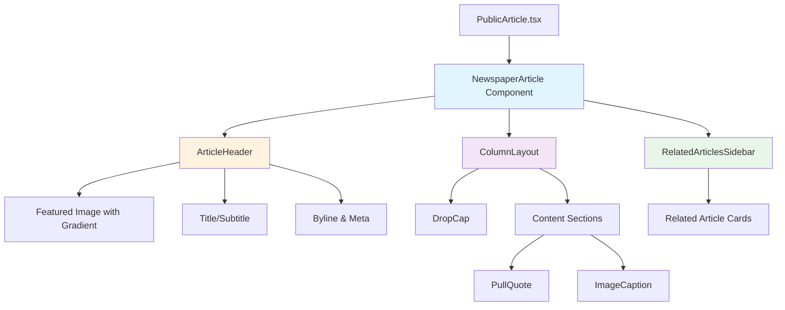

# Design Document

## Overview

This feature transforms the article viewing experience from a basic blog-style layout to a professional digital newspaper presentation. The design implements a foundational styling layer that enhances all articles while preserving template-specific customizations. The solution leverages React components, Tailwind CSS, and CSS Grid/Flexbox to create newspaper-style layouts with multi-column text, enhanced typography, styled pull quotes, and improved visual hierarchy.

The implementation focuses on creating reusable, modular components that can be integrated into both `PublicArticle.tsx` (public viewing) and potentially other article display contexts. The design ensures backward compatibility with the existing template system while providing immediate visual improvements for all articles.

## Steering Document Alignment

### Technical Standards

Since steering documents do not exist for this project, the design follows the established patterns found in the codebase:

- **TypeScript Strict Mode**: All components use strict TypeScript with proper interfaces
- **React Functional Components**: Use hooks (useState, useEffect, useMemo) following existing patterns
- **Tailwind CSS First**: Styling primarily through Tailwind utility classes
- **Component Modularity**: Small, focused components with single responsibilities
- **i18n Support**: Integration with react-i18next for multilingual content (EN/ES)
- **API Client Pattern**: Use fetch API with proper error handling
- **Conventional Commits**: Follow project's commit message standards

### Project Structure

The implementation follows the existing project structure:

```
src/client/
├── components/
│   ├── ArticleLayout/        # NEW: Newspaper layout components
│   │   ├── ColumnLayout.tsx
│   │   ├── DropCap.tsx
│   │   ├── PullQuote.tsx
│   │   ├── ImageCaption.tsx
│   │   ├── ArticleHeader.tsx
│   │   ├── RelatedArticlesSidebar.tsx
│   │   └── NewspaperArticle.tsx  # Main wrapper component
│   └── PublicArticle/         # Existing disclaimer components
├── pages/
│   └── PublicArticle.tsx      # Modified to use new layout
└── styles/
    └── newspaper.css          # NEW: Base newspaper styles
```

## Code Reuse Analysis

### Existing Components to Leverage

- **DisclaimerBanner**: Already sticky and well-positioned; will remain above newspaper layout
- **DisclaimerFooter**: Will be positioned below newspaper content
- **Watermark**: Overlays content; continues working without modification
- **PublicArticle.tsx Structure**: Existing fetch logic, error handling, and loading states will be preserved

### Existing Patterns to Follow

- **Component Documentation**: JSDoc-style comments explaining purpose (seen in DisclaimerBanner.tsx:3-11)
- **i18n Usage**: `useTranslation()` hook for all user-facing text
- **Responsive Grid**: `grid grid-cols-1 lg:grid-cols-3 gap-8` pattern from PublicArticle.tsx:116
- **Brand Color Injection**: `style={{ color: article.brand.primaryColor }}` pattern (PublicArticle.tsx:129)
- **Tailwind Styling**: Extensive use of utility classes for responsive design

### Integration Points

#### Template System Integration
- **Database**: No changes to Prisma schema; Template model remains unchanged
- **CSS Cascade**: New newspaper styles load before template.cssStyles
- **HTML Structure**: template.htmlStructure is injected into article content area
- **Brand Colors**: Use article.brand.primaryColor and accentColor for accents

#### Article Data Model
Current Article interface (PublicArticle.tsx:9-31) provides:
- `content`: HTML string for article body
- `featuredImage`: Optional header image
- `brand`: Object with colors, logo, name
- `relatedArticles`: Array for sidebar
- `tags`, `category`, `authorName`, `publishedAt`: Metadata for header

No backend changes required; all enhancements are client-side presentation.

## Architecture

### Modular Design Principles

The design follows strict modularity:

1. **Component Isolation**: Each layout feature (drop caps, pull quotes, columns) is a separate component
2. **Single File Responsibility**:
   - `DropCap.tsx`: Only handles first-letter styling
   - `PullQuote.tsx`: Only handles blockquote rendering
   - `ColumnLayout.tsx`: Only handles multi-column text distribution
3. **Composition Over Configuration**: Main `NewspaperArticle` component composes smaller pieces
4. **Style Separation**: Base newspaper CSS in dedicated file, component-specific styles via Tailwind

### Component Architecture



### CSS Strategy

1. **Base Layer** (newspaper.css):
   - Typography: Serif for body, sans-serif for headings
   - Column layout utilities
   - Drop cap styles
   - Pull quote base styles

2. **Tailwind Layer** (component classes):
   - Responsive breakpoints
   - Spacing and sizing
   - Colors (with brand color overrides)

3. **Template Layer** (template.cssStyles):
   - Highest specificity
   - Can override base styles
   - Loaded after base styles

### Responsive Strategy

- **Mobile (<768px)**: Single column, stacked layout, related articles below content
- **Tablet (768px-1023px)**: Single column with optimal line length, sticky sidebar
- **Desktop (≥1024px)**: Two-column content after first paragraph, sticky sidebar

## Components and Interfaces

### Component 1: NewspaperArticle

**Purpose:** Main wrapper component that orchestrates the newspaper layout

**Interface:**
```typescript
interface NewspaperArticleProps {
  article: {
    id: string;
    title: string;
    subtitle?: string;
    content: string; // HTML string
    excerpt: string;
    authorName: string;
    publishedAt: string;
    readTime?: number;
    featuredImage?: string;
    category: string;
    tags: string[];
    brand: {
      name: string;
      primaryColor: string;
      accentColor: string;
      logoUrl?: string;
    };
    relatedArticles: RelatedArticle[];
  };
}
```

**Dependencies:** ArticleHeader, ColumnLayout, RelatedArticlesSidebar, useTranslation

**Reuses:** Existing article data structure from PublicArticle.tsx

---

### Component 2: DropCap

**Purpose:** Renders first letter of first paragraph as a decorative drop cap

**Interface:**
```typescript
interface DropCapProps {
  children: string; // First character
  brandColor?: string; // Optional brand accent color
}
```

**Dependencies:** None

**Reuses:** Brand color injection pattern from PublicArticle.tsx

**Implementation Notes:**
- Extract first character from content
- Apply 2-3 line height
- Use brand accent color or default to elegant serif
- CSS: `float: left`, proper margin and padding

---

### Component 3: PullQuote

**Purpose:** Renders blockquotes as visually distinct pull quotes

**Interface:**
```typescript
interface PullQuoteProps {
  children: React.ReactNode; // Quote content
  attribution?: string; // Optional quote source
  brandColor?: string;
}
```

**Dependencies:** useTranslation (for "—" attribution formatting)

**Reuses:** Brand color for border accent

**Implementation Notes:**
- Larger font size (1.25rem)
- Decorative quotation marks (::before, ::after)
- Left border or background tint using brand color
- Minimum 2rem spacing above/below
- Desktop: Can be floated or centered

---

### Component 4: ImageCaption

**Purpose:** Renders images with captions and photo credits

**Interface:**
```typescript
interface ImageCaptionProps {
  src: string;
  alt: string;
  caption?: string;
  credit?: string;
}
```

**Dependencies:** None

**Reuses:** Existing image rendering pattern

**Implementation Notes:**
- Responsive image sizing
- Caption in smaller, italic text below image
- Credit in even smaller gray text
- Proper spacing (1.5rem) from surrounding text

---

### Component 5: ColumnLayout

**Purpose:** Distributes article content into newspaper-style columns

**Interface:**
```typescript
interface ColumnLayoutProps {
  content: string; // HTML string
  brandColor?: string;
}
```

**Dependencies:** DropCap, PullQuote, ImageCaption, useMemo (for content parsing)

**Reuses:** dangerouslySetInnerHTML pattern from PublicArticle.tsx:165

**Implementation Notes:**
- Parse HTML to identify paragraphs, blockquotes, images
- First paragraph: single column with drop cap
- Subsequent paragraphs: two-column on desktop
- Break columns for full-width elements (images, pull quotes)
- Use CSS `column-count` or CSS Grid for column distribution
- Prevent orphaned lines with `break-inside: avoid`

---

### Component 6: ArticleHeader

**Purpose:** Renders article title, subtitle, byline, and featured image with overlay

**Interface:**
```typescript
interface ArticleHeaderProps {
  title: string;
  subtitle?: string;
  authorName: string;
  publishedAt: string;
  readTime?: number;
  category: string;
  featuredImage?: string;
  brandColor: string;
}
```

**Dependencies:** useTranslation

**Reuses:** Existing metadata rendering from PublicArticle.tsx:139-151

**Implementation Notes:**
- If featuredImage exists: large image with gradient overlay, title overlaid in white
- If no image: standard header with title, subtitle
- Byline section: author • date • read time • category
- Social share icons (optional, can be added in future task)
- Category tag styled with brand color

---

### Component 7: RelatedArticlesSidebar

**Purpose:** Displays related articles in a sidebar (desktop) or horizontal carousel (mobile)

**Interface:**
```typescript
interface RelatedArticle {
  id: string;
  title: string;
  slug: string;
  featuredImage?: string;
  category: string;
}

interface RelatedArticlesSidebarProps {
  articles: RelatedArticle[];
  brandColor: string;
  onArticleClick?: (slug: string) => void;
}
```

**Dependencies:** useTranslation, useState (for carousel on mobile)

**Reuses:** Existing related articles from PublicArticle.tsx:186-203

**Implementation Notes:**
- Desktop: Sticky sidebar (top-24) with card-based layout
- Mobile/Tablet: Horizontal scrollable carousel or stacked list
- Each item: thumbnail, title, category badge
- Click handler navigates to article
- Sticky behavior respects footer (doesn't overlap)

## Data Models

### ArticleContent (Parsed Structure)

```typescript
interface ParsedContent {
  elements: ContentElement[];
}

interface ContentElement {
  type: 'paragraph' | 'blockquote' | 'image' | 'heading';
  content: string;
  metadata?: {
    caption?: string;
    credit?: string;
    attribution?: string;
  };
}
```

**Purpose:** Internal representation of parsed article HTML for layout distribution

**Usage:** ColumnLayout component parses article.content into this structure to apply layout rules

---

### NewspaperLayoutConfig (Optional Future Enhancement)

```typescript
interface NewspaperLayoutConfig {
  columnCount?: number; // 1 or 2, default 2 on desktop
  dropCapEnabled?: boolean; // default true
  pullQuoteStyle?: 'bordered' | 'background' | 'centered';
  fontScale?: 'compact' | 'standard' | 'comfortable';
}
```

**Purpose:** Future configuration to allow template-level customization

**Note:** Not implemented in initial version; all articles use same layout rules

## Error Handling

### Error Scenarios

#### 1. Malformed HTML Content
**Description:** Article content contains invalid or dangerous HTML

**Handling:**
- Use `rehype-sanitize` (already in package.json) to sanitize HTML
- Fallback to plain text if sanitization fails
- Log error with article ID for debugging

**User Impact:** Article displays safely without malicious scripts; layout may be simplified

---

#### 2. Missing or Broken Images
**Description:** featuredImage or content images fail to load

**Handling:**
- Use img `onError` handler to hide broken images
- Display alt text with styled placeholder
- Log warning (don't break layout)

**User Impact:** Article remains readable; missing images don't create visual gaps

---

#### 3. Extremely Long Paragraphs
**Description:** Content has paragraphs >1000 words causing layout issues

**Handling:**
- CSS `overflow-wrap: break-word` to prevent horizontal scroll
- Max width constraints on paragraphs
- Column layout naturally breaks long text

**User Impact:** Text wraps correctly; no horizontal scrolling

---

#### 4. No Related Articles
**Description:** relatedArticles array is empty

**Handling:**
- Conditionally render sidebar only if articles exist
- Main content expands to full width (adjust grid cols)

**User Impact:** Clean layout without empty sidebar

---

#### 5. Template CSS Conflicts
**Description:** template.cssStyles override newspaper layout in unexpected ways

**Handling:**
- Use CSS specificity (newspaper base styles have lower specificity)
- Namespace newspaper styles with `.newspaper-layout` class
- Document override points for template authors

**User Impact:** Template customizations take precedence; layout degrades gracefully

## Testing Strategy

### Unit Testing

**Framework:** Jest + React Testing Library (already configured)

**Components to Test:**
1. **DropCap**:
   - Renders first character correctly
   - Applies brand color when provided
   - Falls back to default color

2. **PullQuote**:
   - Renders quote content
   - Displays attribution when provided
   - Applies brand color to border/accent

3. **ImageCaption**:
   - Renders image with caption and credit
   - Handles missing caption/credit gracefully

4. **ArticleHeader**:
   - Displays all metadata correctly
   - Handles missing subtitle/featured image
   - Formats dates correctly

5. **RelatedArticlesSidebar**:
   - Renders list of related articles
   - Handles empty array
   - Click handlers work correctly

**Example Test:**
```typescript
// tests/unit/components/DropCap.test.tsx
describe('DropCap', () => {
  it('renders first character with brand color', () => {
    render(<DropCap brandColor="#ff0000">T</DropCap>);
    const dropCap = screen.getByText('T');
    expect(dropCap).toHaveStyle({ color: '#ff0000' });
  });
});
```

---

### Integration Testing

**Framework:** Jest + Supertest (for API), React Testing Library (for components)

**Flows to Test:**
1. **Full Article Rendering**:
   - Fetch article from API
   - Render NewspaperArticle component
   - Verify all sections render (header, content, sidebar)
   - Check responsive breakpoints

2. **Template Integration**:
   - Render article with custom template
   - Verify template CSS loads after newspaper CSS
   - Ensure template styles apply correctly

3. **Content Parsing**:
   - Parse HTML content with various elements
   - Verify paragraphs, blockquotes, images detected
   - Check column layout distribution

**Example Test:**
```typescript
// tests/integration/NewspaperArticle.test.tsx
describe('NewspaperArticle Integration', () => {
  it('renders article with all components', async () => {
    const article = await fetchMockArticle();
    render(<NewspaperArticle article={article} />);

    expect(screen.getByText(article.title)).toBeInTheDocument();
    expect(screen.getByText(/Related Articles/i)).toBeInTheDocument();
    expect(screen.getAllByRole('article')).toHaveLength(1);
  });
});
```

---

### End-to-End Testing

**Framework:** Playwright (already configured)

**User Scenarios to Test:**

1. **Public Article Viewing - Desktop**:
   - Navigate to article URL
   - Verify two-column layout appears
   - Check drop cap on first paragraph
   - Scroll to verify sticky sidebar
   - Verify disclaimer banner remains visible

2. **Public Article Viewing - Mobile**:
   - Navigate to article on mobile viewport
   - Verify single-column layout
   - Check related articles appear below content
   - Verify responsive images

3. **Article with Custom Template**:
   - Navigate to article with extracted template
   - Verify newspaper layout and template styles both apply
   - Check brand colors appear correctly

4. **Accessibility**:
   - Navigate article with keyboard only
   - Verify focus indicators visible
   - Run axe-core accessibility checks
   - Test with screen reader (VoiceOver/NVDA)

**Example E2E Test:**
```typescript
// tests/e2e/newspaper-layout.spec.ts
import { test, expect } from '@playwright/test';

test('article displays in newspaper layout on desktop', async ({ page }) => {
  await page.goto('/nytimes/article/2025/01/sample-article');

  // Check two-column layout on desktop
  await page.setViewportSize({ width: 1920, height: 1080 });
  const columns = await page.locator('.newspaper-columns').count();
  expect(columns).toBeGreaterThan(0);

  // Verify drop cap
  const dropCap = page.locator('.drop-cap').first();
  await expect(dropCap).toBeVisible();

  // Check sticky sidebar
  const sidebar = page.locator('[data-testid="related-articles-sidebar"]');
  await expect(sidebar).toHaveCSS('position', 'sticky');
});
```

---

### Visual Regression Testing (Future Enhancement)

**Tools:** Percy or Chromatic (not currently in project)

**Scenarios:**
- Capture baseline screenshots of articles
- Compare layout changes across breakpoints
- Detect unintended CSS changes

**Note:** Not included in initial implementation; can be added in future iterations

## Performance Considerations

### CSS Bundle Size
- Base newspaper.css: Target <5KB (minified)
- Use Tailwind purge to remove unused classes
- Inline critical CSS for above-the-fold content

### Layout Calculation
- Content parsing happens once, memoized with useMemo
- Column distribution uses CSS Grid (GPU accelerated)
- Avoid JavaScript layout calculations on scroll

### Image Optimization
- Lazy load below-the-fold images
- Use responsive images (srcset) if available
- Compress featured images (Sharp already in package.json)

### Render Performance
- Component memoization with React.memo for pure components
- Avoid re-parsing content on every render
- Minimize DOM depth in column layout

## Accessibility

### Semantic HTML
- Use `<article>`, `<header>`, `<aside>`, `<blockquote>` elements
- Proper heading hierarchy (h1 → h2 → h3)
- Alt text for all images

### Keyboard Navigation
- All interactive elements focusable
- Visible focus indicators (ring-2 ring-blue-500)
- Skip to content link (optional enhancement)

### Screen Reader Support
- Proper ARIA labels for sidebar sections
- sr-only class for visual indicators that need text equivalents
- Announce related articles count

### Color Contrast
- Body text: 4.5:1 minimum (WCAG AA)
- Large text (headings): 3:1 minimum
- Test brand colors for sufficient contrast
- Provide fallback if brand colors fail contrast

### Responsive Text
- Support text zoom to 200% without horizontal scroll
- Relative units (rem, em) instead of fixed pixels
- Readable line length at all zoom levels

## Template Integration Specification

### CSS Cascade Order

1. **Reset & Base** (globals.css)
2. **Tailwind Base Layer** (@tailwind base)
3. **Newspaper Base Styles** (newspaper.css)
4. **Tailwind Components** (@tailwind components)
5. **Component Inline Styles** (Tailwind utilities in JSX)
6. **Template Styles** (template.cssStyles injected)
7. **Tailwind Utilities** (@tailwind utilities)

### Template Override Points

Templates can customize newspaper layout by including these CSS variables:

```css
/* In template.cssStyles */
.newspaper-layout {
  --newspaper-column-count: 1; /* Override to disable columns */
  --newspaper-font-body: 'Custom Serif', serif;
  --newspaper-font-heading: 'Custom Sans', sans-serif;
  --newspaper-drop-cap-size: 4rem; /* Customize drop cap */
}
```

### Brand Color Application

Brand colors applied via inline styles (highest specificity):
- Links: `article.brand.accentColor`
- Section dividers: `article.brand.primaryColor`
- Pull quote borders: `article.brand.accentColor`
- Category badges: `article.brand.accentColor`

Templates can override by using `!important` in their CSS (not recommended but supported).

## Migration Path

### Phase 1: Initial Implementation (This Spec)
- Create all newspaper layout components
- Update PublicArticle.tsx to use NewspaperArticle component
- Add newspaper.css base styles
- Test with default templates

### Phase 2: Template Compatibility (Future)
- Test with all extracted templates
- Document override patterns for template authors
- Create template testing suite

### Phase 3: Customization (Future)
- Add NewspaperLayoutConfig to Template model
- UI for template authors to customize layout
- Per-template layout preferences

### Phase 4: Advanced Features (Future)
- Floating images within columns
- Interactive elements (footnotes, annotations)
- Print stylesheet for physical newspapers
- Social share integration

## Open Questions & Future Considerations

1. **Content Parsing**: Should we use a proper HTML parser library (jsdom, htmlparser2) or DOMParser API?
   - **Decision:** Use browser's DOMParser API (no additional dependencies)

2. **Column Distribution**: CSS columns or CSS Grid?
   - **Decision:** Start with CSS columns for simplicity; can migrate to Grid for advanced layouts

3. **Mobile Related Articles**: Carousel or stacked list?
   - **Decision:** Stacked list (simpler, more accessible); carousel can be future enhancement

4. **Drop Cap**: Always on first paragraph or configurable?
   - **Decision:** Always on first paragraph; configurable in Phase 3

5. **Social Share Icons**: Include in ArticleHeader or separate component?
   - **Decision:** Separate component, added in future task (out of scope for this spec)

6. **Print Styles**: Should we include newspaper-quality print CSS?
   - **Decision:** Future enhancement (Phase 4); focus on screen presentation first

7. **RTL Support**: How to handle right-to-left languages?
   - **Decision:** Out of scope for initial implementation (project supports EN/ES only)

## Dependencies

### New Dependencies
- None (all features use existing dependencies)

### Existing Dependencies Used
- `react`, `react-dom`: Component framework
- `tailwindcss`: Styling utilities
- `react-i18next`: Internationalization
- `react-helmet-async`: SEO meta tags
- `rehype-sanitize`: HTML sanitization (security)

## Success Metrics

### User Experience
- Article read time increases by 20% (more engagement)
- Bounce rate decreases (better retention)
- Positive user feedback on visual improvements

### Technical
- CSS bundle size increase <5KB
- No performance regression (Lighthouse score ≥90)
- Zero accessibility violations (axe-core)
- All tests passing (unit, integration, E2E)

### Business
- Articles appear more professional/authentic
- Easier to demonstrate value to potential users
- Enhanced brand differentiation
